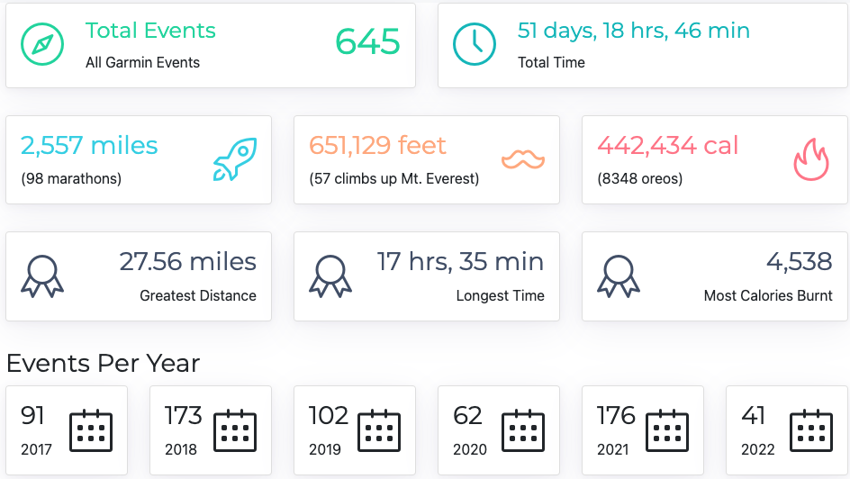

# EventTrackerProject

  -- Developed for Skill Distillery Bootcamp Cohort 32 --

### Description

  This project uses a REST API via JPA and Spring, along with an Angular frontend, to perform CRUD and search procedures through a JSON-based API.  The database consists of one table - garmin_event - containing my personal activities imported through Garmin Connect.

### Technologies Used

- Java
- MySql
- MAMP
- MYSQL Workbench
- Spring Boot
- JPA
- jparepository
- Gradle
- Spring Tool Suite 4
- Angular
- DataTables
- Bootstrap
- Postman
- Atom
- Github
- Terminal
- Garmin Connect (for exporting data)
- Google Chrome
- MacBook Pro Retina 2015

### Routes
Each of these routes speaks to a specific method and mapping in the controller class.  Parameters and/or JSON body is received by the controller, which sends data or a request to the corresponding method in the service class, which in turn sends data or a request to the repository, which may or may not use an implemented method from the jparepository interface.

<table>
    <tr>
        <th>Used</th>
        <th>Local</th>
        <th>AWS</th>
        <th>Description</th>
    </tr>
    <tr>
        <td>:white_check_mark:</td>
        <td>GET /api/index</td>
        <td><a href="http://52.52.235.108:8080/GarminTrackerRestApplication/api/index">Link</a>>
        <td>all</td>
    </tr>
    <tr>
        <td>:white_check_mark:</td>
        <td>GET /api/{id}</td>
        <td><a href="http://52.52.235.108:8080/GarminTrackerRestApplication/api/1">Link</a>>
        <td>single</td>
    </tr>
    <tr>
        <td>:white_check_mark:</td>
        <td>POST /api/create</td>
        <td><a href="http://52.52.235.108:8080/GarminTrackerRestApplication/api/create">Link</a>>
        <td>create</td>
    </tr>
    <tr>
        <td>:white_check_mark:</td>
        <td>PUT /api/update/{id}</td>
        <td><a href="http://52.52.235.108:8080/GarminTrackerRestApplication/api/update/1">Link</a>>
        <td>update</td>
    </tr>
    <tr>
        <td>:white_check_mark:</td>
        <td>DELETE /api/update/{id}</td>
        <td>http://52.52.235.108:8080/GarminTrackerRestApplication/api/delete/1">Link</a>>
        <td>delete</td>
    </tr>
    <tr>
        <td>:white_check_mark:</td>
        <td>DELETE /api/search/distance/{low}/{high}</td>
        <td><a href="http://52.52.235.108:8080/GarminTrackerRestApplication/api/search/distance/1/10">Link</a>>
        <td>search distance</td>
    </tr>
</table>

- http://localhost:8082/api/index : display all objects in GarminEvent table
- http://localhost:8082/api/1 : display one specific GarminEvent by id
- http://localhost:8082/api/create : create new GarminEvent
- http://localhost:8082/api/update/1 : update by id (int)
- http://localhost:8082/api/delete/1 : delete by id (int)
- http://localhost:8082/api/search/distance/1/10 : search by distance between (double low /double high)
- http://localhost:8082/api/search/calories/500/1500 : search by calories burnt between (int low / int high)
- http://localhost:8082/api/search/date/2019-01-01/2020-12-31 : search by date between (yyyy-mm-dd low / yyyy-mm-dd high)
- http://localhost:8082/api/search/time/moving/04:00:00/23:00:00 : search by time moving between (hh-mm-ss low / hh-mm-ss high)
- http://localhost:8082/api/search/time/elapsed/04:00:00/23:00:00 : search by time elapsed between (hh-mm-ss low / hh-mm-ss high)
- http://localhost:8082/api/search/ascent/5000/50000 : search by total ascent between (int low / int high)
- http://localhost:8082/api/search/descent/5000/50000 : search by total descent between (int low / int high)

### AWS routes
- http://52.52.235.108:8080/GarminTrackerRestApplication/api/index : display all objects in GarminEvent table
- http://52.52.235.108:8080/GarminTrackerRestApplication/api/1 : display one specific GarminEvent by id
- http://52.52.235.108:8080/GarminTrackerRestApplication/api/create : create new GarminEvent
- http://52.52.235.108:8080/GarminTrackerRestApplication/api/update/1 : update by id (int)
- http://52.52.235.108:8080/GarminTrackerRestApplication/api/delete/1 : delete by id (int)
- http://52.52.235.108:8080/GarminTrackerRestApplication/api/search/distance/1/10 : search by distance between (double low /double high)
- http://52.52.235.108:8080/GarminTrackerRestApplication/api/search/calories/500/1500 : search by calories burnt between (int low / int high)
- http://52.52.235.108:8080/GarminTrackerRestApplication/api/search/date/2019-01-01/2020-12-31 : search by date between (yyyy-mm-dd low / yyyy-mm-dd high)
- http://52.52.235.108:8080/GarminTrackerRestApplication/api/search/time/moving/04:00:00/23:00:00 : search by time moving between (hh-mm-ss low / hh-mm-ss high)
- http://52.52.235.108:8080/GarminTrackerRestApplication/api/search/time/elapsed/04:00:00/23:00:00 : search by time elapsed between (hh-mm-ss low / hh-mm-ss high)
- http://52.52.235.108:8080/GarminTrackerRestApplication/api/search/ascent/5000/50000 : search by total ascent between (int low / int high)
- http://52.52.235.108:8080/GarminTrackerRestApplication/api/search/descent/5000/50000 : search by total descent between (int low / int high)

### Thoughts For The Future

  This project evolved over several steps - first, a JPA project, then adding a Spring REST, then an Angular frontend.  It was surprisingly difficult to get Angular to work with Datatables or any other outside resources.  After trying to integrate many templates and other pre-existing components like ngbootstrap, I settled for only integrating DataTables.  This was only a weekend project, after all.

## The Data

I use a Garmin Fenix 5 watch to track my activities - typically running and hiking.  For this project, I imported my own personal data from the [Garmin Connect](https://connect.garmin.com) website into the project's database.

On Garmin Connect / Activities, as on 5/21/22, **activities** are displayed in a table with reach row:


Data was exported in .csv format and cleaned up via find/replace in [Google Sheets](sheets.google.com) - things like null, dates, numbers with commas, etc.  Next, the cleaned up data was again exported as a .csv and imported into MySQLWorkbench.  

From here, the schema was forward engineered directly into the local server (run on **MAMP**).

### garmindb
The database contains only one table, `garmin_event`:

```
+-----------------+-------------+------+-----+---------+----------------+
| Field           | Type        | Null | Key | Default | Extra          |
+-----------------+-------------+------+-----+---------+----------------+
| id              | int(11)     | NO   | PRI | NULL    | auto_increment |
| type            | varchar(45) | NO   |     | NULL    |                |
| date            | datetime    | YES  |     | NULL    |                |
| title           | varchar(45) | YES  |     | NULL    |                |
| distance        | double      | YES  |     | NULL    |                |
| calories        | int(11)     | YES  |     | NULL    |                |
| time            | time        | YES  |     | NULL    |                |
| hr_avg          | int(11)     | YES  |     | NULL    |                |
| hr_max          | int(11)     | YES  |     | NULL    |                |
| aerobic_te      | double      | YES  |     | NULL    |                |
| run_cadence_avg | int(11)     | YES  |     | NULL    |                |
| run_cadence_max | int(11)     | YES  |     | NULL    |                |
| pace_avg        | time        | YES  |     | NULL    |                |
| ascent          | int(11)     | YES  |     | NULL    |                |
| descent         | int(11)     | YES  |     | NULL    |                |
| time_moving     | time        | YES  |     | NULL    |                |
| time_elapsed    | time        | YES  |     | NULL    |                |
| elevation_min   | int(11)     | YES  |     | NULL    |                |
| elevation_max   | int(11)     | YES  |     | NULL    |                |
+-----------------+-------------+------+-----+---------+----------------+
```

**Sample row with id=1:**

```
+----+---------------+---------------------+-----------------------+----------+----------+
| id | type          | date                | title                 | distance | calories |
+----+---------------+---------------------+-----------------------+----------+----------+
|  1 | Trail Running | 2022-04-03 15:12:06 | Boulder Trail Running |     8.17 |     1426 |
+----+---------------+---------------------+-----------------------+----------+----------+

+----------+--------+--------+------------+-----------------+-----------------+----------+
| time     | hr_avg | hr_max | aerobic_te | run_cadence_avg | run_cadence_max | pace_avg |
+----------+--------+--------+------------+-----------------+-----------------+----------+
| 03:36:43 |    112 |    165 |        3.1 |              59 |             248 | 00:26:32 |
+----------+--------+--------+------------+-----------------+-----------------+----------+

+--------+---------+-------------+--------------+---------------+---------------+
| ascent | descent | time_moving | time_elapsed | elevation_min | elevation_max |
+--------+---------+-------------+--------------+---------------+---------------+
|   7618 |    7608 | 02:41:05    | 03:41:22     |          5706 |          8438 |
+--------+---------+-------------+--------------+---------------+---------------+
```

For simplicity's sake, only two fields are **non-null**: id (generated, auto-increment), and type.

## Using the Data


<table>
<tr>
<th>JPA Entity (GarminEventJPA)</th>
<th>Angular model (ngGarminTracker)</th>
</tr>
<tr>
<td valign="baseline">

```java
@Entity
@Table(name = "garmin_event")
public class GarminEvent {

	@Id
	@GeneratedValue(
        strategy =
            GenerationType.IDENTITY)
	private int id;

	private String type;

	private LocalDateTime date;

	private String title;

	private Double distance;

	private Integer calories;

	private LocalTime time;

	@Column(name = "hr_avg")
	private Integer hrAvg;

	@Column(name = "hr_max")
	private Integer hrMax;

	@Column(name = "aerobic_te")
	private Integer aerobicTe;

	@Column(name = "run_cadence_avg")
	private Integer runCadenceAvg;

	@Column(name = "run_cadence_max")
	private Integer runCadenceMax;

	@Column(name = "pace_avg")
	private LocalTime paceAvg;

	private Integer ascent;

	private Integer descent;

	@Column(name = "time_moving")
	private LocalTime timeMoving;

	@Column(name = "time_elapsed")
	private LocalTime timeElapsed;

	@Column(name = "elevation_min")
	private Integer elevationMin;

	@Column(name = "elevation_max")
	private Integer elevationMax;
}
```
</td>
<td valign="baseline">

```typescript
export class GarminEvent {
  id: number | null;
  type: string | null;
  date: string | null;
  title: string | null;
  distance: number | null;
  calories: number | null;
  time: string | null;
  hrAvg: number | null;
  hrMax: number | null;
  aerobicTe: number | null;
  runCadenceAvg: number | null;
  runCadenceMax: number | null;
  paceAvg: string | null;
  ascent: number | null;
  descent: number | null;
  timeMoving: string | null;
  timeElapsed: string | null;
  elevationMin: number | null;
  elevationMax: number | null;

  constructor(
    id: number | null = null,
    type: string | null = null,
    date: string | null = null,
    title: string | null = null,
    distance: number | null = null,
    calories: number | null = null,
    time: string | null = null,
    hrAvg: number | null = null,
    hrMax: number | null = null,
    aerobicTe: number | null = null,
    runCadenceAvg: number | null = null,
    runCadenceMax: number | null = null,
    paceAvg: string | null = null,
    ascent: number | null = null,
    descent: number | null = null,
    timeMoving: string | null = null,
    timeElapsed: string | null = null,
    elevationMin: number | null = null,
    elevationMax: number | null = null
  ) {
    this.id = id;
    this.type = type;
    this.date = date;
    this.title = title;
    this.distance = distance;
    this.calories = calories;
    this.time = time;
    this.hrAvg = hrAvg;
    this.hrMax = hrMax;
    this.aerobicTe = aerobicTe;
    this.runCadenceAvg = runCadenceAvg;
    this.runCadenceMax = runCadenceMax;
    this.paceAvg = paceAvg;
    this.ascent = ascent;
    this.descent = descent;
    this.timeMoving = timeMoving;
    this.timeElapsed = timeElapsed;
    this.elevationMin = elevationMin;
    this.elevationMax = elevationMax;
  }
}


```

</td>
</tr>
</table>


## Front End Routes

For this simple project, only a few routes are needed:
<table>
<tr>
<th>Route</th>
<th>Component</th>
<th><code>app.routing.module.ts</code></th>
</tr>
<tr>
<td>empty</td>
<td>Home</td>
<td rowspan="4">

```typescript
const routes: Routes = [
  { path: '', pathMatch: 'full',  
        component: HomeComponent },
  { path: 'events', pathMatch: 'full',  
        component: EventsComponent },
  { path: 'events/:id', pathMatch: 'full',  
        component: GarminEventComponent },
  { path: '**', pathMatch: 'full',  
        component: NotFoundComponent }
];
```

</td>
</tr>
<tr>
<td>/events</td>
<td>EventsComponent</td>
</tr>
<tr>
<td>/events/{id}</td>
<td>GarminEventComponent</td>
</tr>
<tr>
<td>everything else</td>
<td>NotFoundComponent</td>
</tr>
</table>

Note: the route /events/create is not actually mapped, as the :id parameter "catches" this.  The GarminEvent component manages and redirects this when validating the parameter, as shown below.

## Single Event

### Validating {id} parameter

When navigating to /events/{id}, I wanted to validate the {id} parameter is truly an integer > 0 and for everything else, to redirect to the not found page.
- **Valid:**
    - /events/1
- **Invalid:**
    - /events/one
    - /events/0
    - /events/-1
    - /events/1.1
    - /events/taco

<table>
<tr>
<th><code>garmin-event.component.ts</code></th>
</tr>
<tr>
<td>

```typescript

// verify and return valid id as integer or null if invalid
private verifyParam = (): number | null => {

// get param 'id' from route as string (null if param empty)
let paramString: string | null = this.route.snapshot.paramMap.get('id');
if (paramString) {
  // re-route if 'create' mode
  if (paramString === 'create') {
    this.beginCreate();
    return null;
  } else if (
    // reroute to not found if parameter is not an int above 0
    isNaN(parseInt(paramString)) ||
    parseInt(paramString).toString() != paramString ||
    parseFloat(paramString) != parseInt(paramString) ||
    parseInt(paramString) <= 0
  ) {
    console.error('invalid parameter: ' + paramString);
  } else {
    // return valid id
    let paramId: number = parseInt(paramString);
    return paramId;
  }
}
// if param is invalid, redirect to not found and return null
this.router.navigateByUrl('/event-not-found/' + paramString);
return null;
};
```

</td>
</tr>
<tr>
<th><code>garmin.service.ts</code></th>
</tr>
<tr>
<td>

```typescript
show(id: number): Observable<GarminEvent> {
  return this.http.get<GarminEvent>(this.url + id).pipe(
    catchError((err: any) => {
      return throwError(
        'garmin.service.ts.show(id=' + id + ') says: not found (404)'
      );
    })
  );
}
```

</td>
</tr>
</table>

## Single Event

### Viewing or Creating an EventTrackerProject
For viewing or creating an event, one set of inputs were used.  These were not within to a form but rather bound to data in the component.  Inputs are disabled/enabled and various button options 'hidden' via,`ngModel`, `ngIf`, and `ngClass` in the html.

Example:

```html
<div class="card-header">
  <h6 *ngIf="this.mode != 'create'" class="card-title">{{event.title}} on {{eventDate}} (id {{event.id}})</h6>
  <h6 *ngIf="this.mode === 'create'" class="card-title">Create a New Event</h6>
</div>
```

A good deal of effort was put into validating the input.  Rather than using an outside library or bootstrap's own validation, the component does this manually.

For example, the `date` property of `GarminEvent` is a `LocalDateTime` in the JPA and is sent as such in the API.  The Angular model stores this as a `String`, and the `Event` page input displays this as text in the format of `1:02:03 PM`.  Various conversion is necessary - not only to military time but to a string in the format `2022-04-03T15:12:06`.

```typescript
// verify Time of Day is not empty
if (!this.timeOfDay) {
 this.invalid = true;
 this.addMessage('Time of Day is required');
} else {
 // verify time is in correct format
 // should be in format: 01:02:03 PM
 let regex = new RegExp('^([0-1]{1}[0-2]{1}|[0]{1}[0-9]{1}):[0-5]{1}[0-9]{1}:[0-5]{1}[0-9]{1}[ ]{1}[A,P]{1}[M]{1}$');
 if (!regex.test(this.timeOfDay)) {
   this.invalid = true;
   this.addMessage('Time of Day must be in format: hh:mm:ss AM/PM (including leading zeros)');
 } else {
   // convert to 2022-04-03T15:12:06
   let newDate = this.datePipe.transform(this.eventDate, 'y-MM-dd');
   let newTOD = this.timeOfDay;
   if (!newDate) {
     this.invalid = true;
     this.addMessage('ERROR converting Date');
   } else {
     // convert to military time
     let arr = newTOD.split(' ');
     if (!arr || arr.length != 2) {
       this.invalid = true;
       this.addMessage('ERROR converting Time Of Day');
     } else {
       if (arr[1] === 'PM') {
         let arr2 = arr[0].split(':');
         if (parseInt(arr2[0]) < 12) {
           // convert hours to military time
           arr2[0] = (parseInt(arr2[0]) + 12).toString();
         }
         newTOD = arr2[0] + ':' + arr2[1] + ':' + arr2[2] + ' PM';
       }
     }
   }
   if (newTOD.includes('M')) {
     // remove AM/PM at end
     newTOD = newTOD.slice(0, newTOD.indexOf('M') - 1);
     this.event.date = newDate + 'T' + newTOD;
   } else {
     this.event.date = newDate + 'T' + newTOD;
   }
  }
}
```

When using this form, at various points, may be necessary to reset the data back to the `event` obtained from the API.  Rather than using `Object.assign` or manually copying all properties, I used JSON to perform a deep copy.

```typescript
this.event = JSON.parse(JSON.stringify(this.backup));
```

## Integrating Datatables

This was surprisingly difficult, perhaps because it was my first time trying to integrate an outside resource other than bootstrap, DatePipe, etc.  I attempted to use things like `PrimeNG` and `ngBootstrap` but this proved time consuming and for the purposes of this project unnecessary.

I was able to use `DataTables` by first installing via the Angular CLI, then adding the following in `Angular.json`

```JSON
"styles": [
  "node_modules/datatables.net-dt/css/jquery.dataTables.css"
],
"scripts": [
  "node_modules/jquery/dist/jquery.js",
  "node_modules/datatables.net/js/jquery.dataTables.js"
]
```

Also, `in app.module.ts`:

```typescript
import { DataTablesModule } from 'angular-datatables';

imports: [
DataTablesModule
],
```

After this, other areas of the project such as the `Events` component could use `DataTables`.

```html
<!-- Data Table -->
<table id="events-table" datatable class="table row-border hover">
<thead>
  <tr>
    <th>Type</th>
    <th>Date</th>
    <th>Title</th>
    <th>Distance</th>
    <th>Calories</th>
    <th>Time</th>
    <th>Ascent</th>
    <th>Descent</th>
  </tr>
</thead>
<tbody>
  <tr *ngFor="let event of events" (click)="show(event.id)">
    <td>{{event.type}}</td>
    <td>{{event.date | date: 'short' }}</td>
    <td>{{event.title}}</td>
    <td>{{event.distance}}</td>
    <td>{{event.calories}}</td>
    <td>{{event.time}}</td>
    <td>{{event.ascent}}</td>
    <td>{{event.descent}}</td>
  </tr>
</tbody>
</table>
```

## Aggregating Data in Home

To produce a summary of data in the `Home` page, while I had several routes in my Rest controller already created to search via year range, distances, and so on, here I simply used `index()` in my Angular service to obtain all `GarminEvent` and then process through in typescript.

```typescript
setSummaries = (): void => {
    let seconds = 0;
    let maxD = 0;
    let maxC = 0;
    let maxT = 0;
    for (let evt of this.events) {
      if (evt) {
        this.totalEvents += 1;
        this.totalMiles += evt.distance ? evt.distance : 0;
        this.totalCalories += evt.calories ? evt.calories : 0;
        this.totalAscent += evt.ascent ? evt.ascent : 0;
        if (evt.distance && evt.distance > maxD) {
          maxD = evt.distance;
        }
        if (evt.calories && evt.calories > maxC) {
          maxC = evt.calories;
        }

        // total time
        if (evt.time) {
          let arr = evt.time.split(':');
          let s = 0;
          if (arr[0]) {
            s += parseInt(arr[0]) * 60 * 60;
          }
          if (arr[1]) {
            s += parseInt(arr[1]) * 60;
          }
          if (arr[2]) {
            s += parseInt(arr[2]);
          }
          seconds += s;
          if (s > maxT) {
            maxT = s;
          }
        }
      }

      let date: Date = new Date();
      if (evt.date) {
        date = new Date(Date.parse(evt.date));
      }
      let year = date.getFullYear();
      if (this.yearCounts.has(year)) {
        let count = this.yearCounts.get(year);
        if (count) {
          this.yearCounts.set(year, count + 1);
        }
      } else {
        this.yearCounts.set(year, 1);
      }
    }
    this.totalTime = this.secondsToHms(seconds);
    this.totalMiles = Math.round(this.totalMiles);
    this.maxTime = this.secondsToHms(maxT);
    this.maxDistance = maxD;
    this.maxCalories = maxC;
    this.everestEquivalent = Math.round(this.totalAscent / 11433.7);
    this.marathonEquivalent = Math.round(this.totalMiles / 26.2188);
    this.oreoEquivalent = Math.round(this.totalCalories / 53);
  };

  secondsToHms(sec: number):string {
    var d = Math.floor(sec / (3600*24));
    var h = Math.floor(sec % (3600*24) / 3600);
    var m = Math.floor(sec % 3600 / 60);
    var s = Math.floor(sec % 60);
    m += Math.round(s / 60);
    if (d > 0) {
      return d + ' days, ' + h + ' hrs, ' + m + ' min';
    } else {
      return h + ' hrs, ' + m + ' min';
    }
}
```



Shoutout to [this codepen](https://codepen.io/lesliesamafful/pen/oNXgmBG) for the example of cards.
